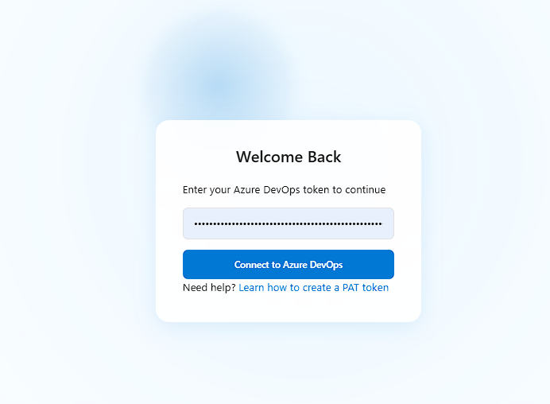
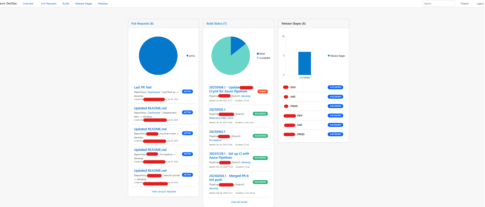
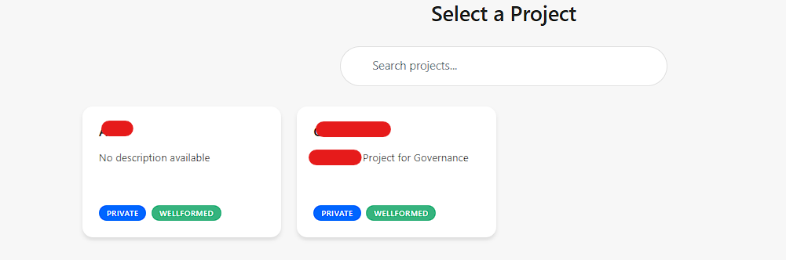
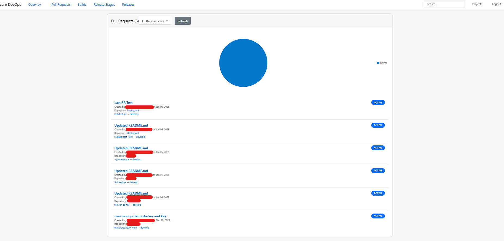
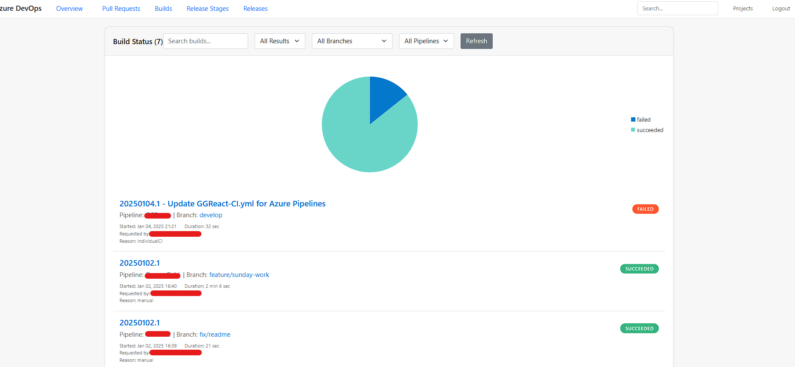
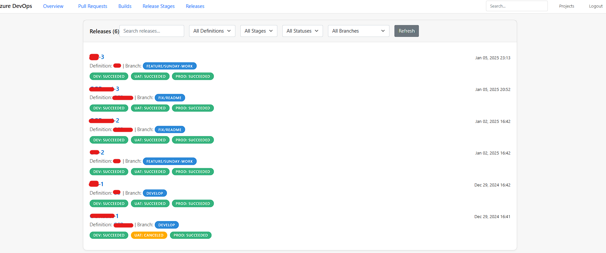

# Azure DevOps Dashboard

A real-time dashboard application for monitoring Azure DevOps projects, built with Blazor Server and Radzen components.

<div align="center">
    
</div>

## Features

- 🔄 Real-time monitoring of:
  - Pull Requests
  - Build Pipelines
  - Release Pipelines
  - Release Stages
- 📊 Interactive charts and visualizations with Radzen
- 🔍 Advanced filtering and search capabilities
- 🎨 Clean, modern UI with responsive design
- 🔐 Secure PAT token authentication
- 📱 Multi-device support

## Screenshots

<div align="center">
    <h3>Dashboard Overview</h3>
    
    <br/><br/>
    <h3>Project Selection</h3>
    
    <br/><br/>    
    <h3>Pull Requests Management</h3>
    
    <br/><br/>
    <h3>Build Pipeline Status</h3>
    
    <br/><br/>
    <h3>Release Management</h3>
    
</div>

## Getting Started

### Prerequisites

- .NET 8.0 SDK or later
- An Azure DevOps account
- Personal Access Token (PAT) with read permissions for:
  - Code (Pull Requests)
  - Build
  - Release
  - Project and Team

### Quick Start

1. Clone the repository:
```bash
git clone https://github.com/yourusername/AzureDevOpsDashboard.git
cd AzureDevOpsDashboard
```

2. Configure your Azure DevOps organization in `appsettings.json`:
```json
{
  "AzureDevOps": {
    "Organization": "YourOrgName"
  }
}
```

3. Build and run:
```bash
dotnet restore
dotnet build
dotnet run
```

4. Open your browser and navigate to:
```
https://localhost:7234
```

5. Enter your Azure DevOps PAT token when prompted

## Features In Detail

### Dashboard
- Real-time metrics overview
- Interactive charts for PRs, builds, and releases
- Quick access to all key metrics

### Pull Requests
- Live PR tracking
- Filter by repository, status, or reviewer
- Direct links to PR details

### Build Pipelines
- Real-time build status monitoring
- Filter by branch, status, or pipeline
- Build history and trends

### Release Management
- Release pipeline status
- Stage-by-stage progress tracking
- Environment deployment status

## Security

- PAT tokens stored in-memory only
- No sensitive data persistence
- HTTPS for all API calls
- Request-level token validation

## Built With

- [.NET 8.0](https://dotnet.microsoft.com/download/dotnet/8.0)
- [Blazor Server](https://docs.microsoft.com/en-us/aspnet/core/blazor/)
- [Radzen Components](https://blazor.radzen.com/)
- [Azure DevOps REST API](https://docs.microsoft.com/en-us/rest/api/azure/devops)

## Contributing

1. Fork the repository
2. Create your feature branch (`git checkout -b feature/AmazingFeature`)
3. Commit your changes (`git commit -m 'Add some AmazingFeature'`)
4. Push to the branch (`git push origin feature/AmazingFeature`)
5. Open a Pull Request

## License

This project is licensed under the MIT License - see the [LICENSE](LICENSE) file for details.

## Support

For support, please open an issue in the GitHub repository or contact the maintainers.

## Acknowledgments

- Microsoft Azure DevOps Team
- Radzen Component Library Team
- The .NET Community
